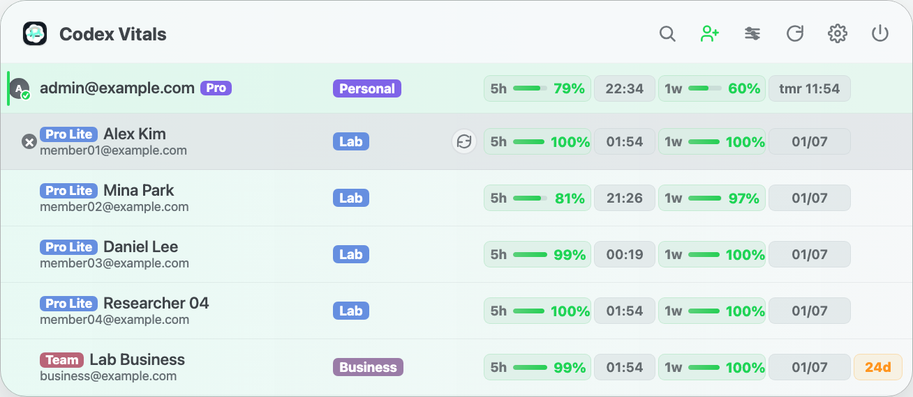

# Codex Vitals: macOS Codex usage vitals in your menu bar

<p align="center">
  
  
  <a href="https://github.com/Joowonoil/codex-vitals/releases">
    
  </a>
  
</p>

<p align="center">
  An unofficial, local-first macOS menu bar app for monitoring Codex usage and switching the active account across Codex CLI and ChatGPT for macOS.
</p>

<p align="center">
  
</p>

## Overview

**Codex Vitals** helps you monitor OpenAI Codex usage, reset windows, account state, and workspaces directly from your Mac menu bar. When you choose an account, the same local Codex sign-in is applied to both Codex CLI in Terminal and the Codex experience in the official ChatGPT macOS app.

- View best-effort Codex quota and usage across all your accounts
- Group accounts by workspace/team
- Add local display aliases so personal accounts are easy to identify
- Reorder accounts manually from the row context menu
- Instantly see which account is active
- Switch the active account used by Codex CLI and ChatGPT for macOS with one click
- Enable Launch at Login from the settings panel
- Tune automatic refresh cadence from the settings panel
- Check for signed app updates and enable automatic installation
- Identify invalid or deactivated accounts

> **Disclaimer:** Codex Vitals is not affiliated with OpenAI. It does not change Codex/OpenAI limits, share accounts, or automate account cycling. It only helps you view local usage state and manually switch between accounts you control.

## Features

- **Codex Quota Dashboard** — Best-effort usage tracking across all linked accounts
- **Workspace Grouping** — Accounts organized by team/workspace
- **Display Aliases** — Local-only account labels for easier scanning while preserving the real email for auth and copy actions
- **Account Health** — Visual indicators for invalid or deactivated accounts
- **One-Click Switching** — Apply a saved account to both Codex CLI and the Codex experience in ChatGPT for macOS
- **Passive Auth Mirroring** — Codex-managed token rotations are mirrored back into saved local profiles
- **Local-First** — All data stays on your machine; no cloud sync
- **Secure Token Storage** — Sensitive files written with `0600` permissions
- **Settings Panel** — Manage Launch at Login, usage refresh, and application updates inside the menu bar popover
- **Signed Automatic Updates** — Sparkle checks every 24 hours and verifies update archives with EdDSA before installation
- **Network-Friendly Refresh** — Automatic usage refresh defaults to 10 minutes, metadata is cached, and account requests are throttled
- **Smart Ordering** — Accounts are implicitly ranked by a composite score so the "best account to use now" surfaces to the top

## Account Switching and Session Continuity

Codex Vitals switches the shared local Codex credential rather than maintaining separate sign-ins for each interface.

- **Terminal and ChatGPT stay aligned** — Selecting an account updates `~/.codex/auth.json`, which is used by new Codex CLI runs and by Codex inside the official ChatGPT macOS app.
- **Safe handoff** — To avoid auth and database conflicts, Codex Vitals closes active Codex processes, backs up the current auth file, applies the selected profile, and relaunches the macOS app. A running CLI session may therefore close during a switch.
- **Local sessions remain available** — Codex session history stays in the local Codex data directory. After switching accounts, use `/resume` or `codex resume` to reopen earlier work.
- **The selected account handles new requests** — Resuming preserves the local conversation and workspace context, but subsequent requests use the currently active account's limits and permissions.
- **Switching is always manual** — Codex Vitals never rotates accounts in the background; a switch occurs only after you explicitly choose an account.

## Smart Ordering

Codex Vitals automatically re-orders your accounts so the best one to use right now appears first.

- **Smart score** — Uses the lowest remaining balance among the quota windows currently reported by OpenAI; the account with the highest bottlenecked balance wins.
- **Priority strip** — Accounts with useful balance whose weekly window resets in less than 24 hours get a temporary urgency boost and appear in a dedicated top section.
- **Exhausted accounts** — Sorted by who resets first, so you know which one will be usable again soonest.
- **Free reset group** — Free-plan accounts waiting for session reset are grouped separately so daily-use paid/workspace accounts stay easier to scan.

## Requirements

- macOS 13 (Ventura) or newer
- ChatGPT for macOS installed as `ChatGPT.app`, or the legacy `Codex.app` (for account switching)

## Installation

### Option 1: Installer Package (Recommended)

Download the latest `.pkg` from [Releases](../../releases), double-click to run the installer, and Codex Vitals will be installed to `/Applications`.

### Option 2: Build From Source

```bash
git clone https://github.com/Joowonoil/codex-vitals.git
cd codex-vitals
swift test
swift build
./build-app.sh
open dist/CodexVitals.app
```

### Building the Installer

To generate a `.pkg` installer from the built app:

```bash
./build-app.sh
./build-pkg.sh
```

The installer will be created at `dist/CodexVitals-<version>.pkg`.

Sparkle release feeds are generated after a signed and notarized DMG is ready:

```bash
scripts/prepare-sparkle-update.sh <version> dist/CodexVitals-<version>.dmg [release-notes.md]
```

## Data & Privacy

Codex Vitals is local-first and never syncs tokens or exposes a remote service.

### Local Files

| Path | Purpose |
|------|---------|
| `~/Library/Application Support/CodexVitals/accounts.json` | Account list |
| `~/Library/Application Support/CodexVitals/profiles/<profile>/auth.json` | Profile tokens |
| `~/Library/Application Support/CodexVitals/profiles/<profile>/meta.json` | Profile metadata |
| `~/Library/Application Support/CodexVitals/accounts-snapshot.json` | Usage snapshots |
| `~/Library/Application Support/CodexVitals/team-name-cache.json` | Team name cache |
| `~/Library/Application Support/CodexVitals/backups/<timestamp>-remove-account/` | Backups before removal |

All sensitive files are written with `0600` permissions. Removal actions create backups before deleting profile data.

### Network Calls

The app uses your local Codex/OpenAI auth tokens to query:

- `https://chatgpt.com/backend-api/codex/usage`
- `https://chatgpt.com/backend-api/accounts/check/v4-2023-04-27`
- `https://auth.openai.com/oauth/authorize`
- `https://auth.openai.com/oauth/token`
- `https://ramterstudio.com/codex-vitals/appcast.xml` for application update metadata
- GitHub Releases for signed application update downloads

These are not official public APIs and may change without notice.

Automatic usage refresh defaults to 10 minutes. Account metadata is cached for 6 hours during automatic refreshes, while manual refresh always requests fresh usage and metadata.

Application update checks are separate from account refreshes. Sparkle checks at most once every 24 hours by default, and both automatic checks and automatic installation can be changed in Settings.

### Security

- Bearer tokens are never logged or transmitted to third parties
- OAuth callback server binds only to `localhost:1455` and closes immediately after login
- See [SECURITY.md](SECURITY.md) for the full threat model

## FAQ

### Does Codex Vitals work with OpenAI Codex?

Yes. Codex Vitals is built for local OpenAI Codex account usage visibility and manual account switching on macOS.

### Does it track Codex quota and reset windows?

It shows best-effort Codex usage and reset timing from the local app using your existing Codex/OpenAI auth state. The underlying endpoints are not official public APIs and may change.

### Does it switch Codex accounts automatically?

No. Codex Vitals does not automate account cycling. It only changes the active local Codex account after an explicit manual action.

### Does account switching work in both Terminal and ChatGPT for macOS?

Yes. Codex Vitals updates the shared local Codex credential used by new Codex CLI runs and by Codex inside the official ChatGPT macOS app.

### Will switching accounts remove my Codex sessions?

No. Session history remains stored locally, so earlier work can be reopened with `/resume` or `codex resume`. Continued requests run under the account that is active when the session is resumed.

### Does it upload tokens or account data?

No. Codex Vitals is local-first and does not sync tokens, account data, or usage snapshots to a third-party service.

## Contributing

Issues and pull requests are welcome. Please keep changes local-first, avoid token logging, and run `swift test` before opening a PR.

See [CONTRIBUTING.md](CONTRIBUTING.md) for guidelines.

## License

[MIT](LICENSE)

The distributed app includes Sparkle under its bundled license notice.
